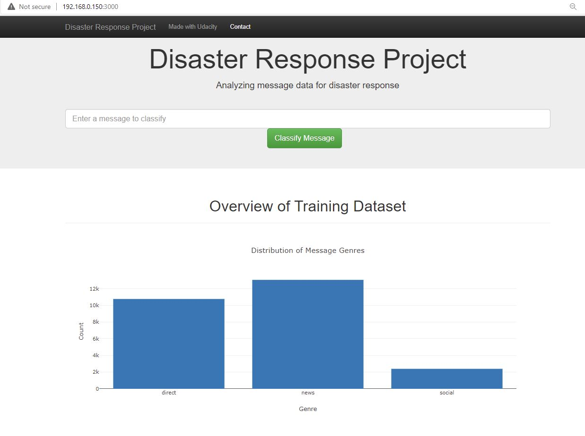
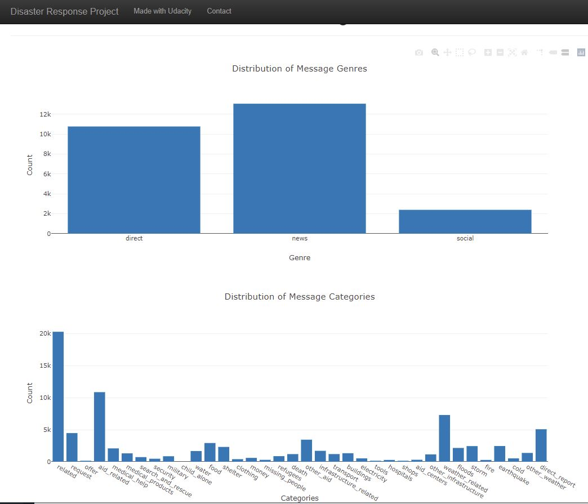
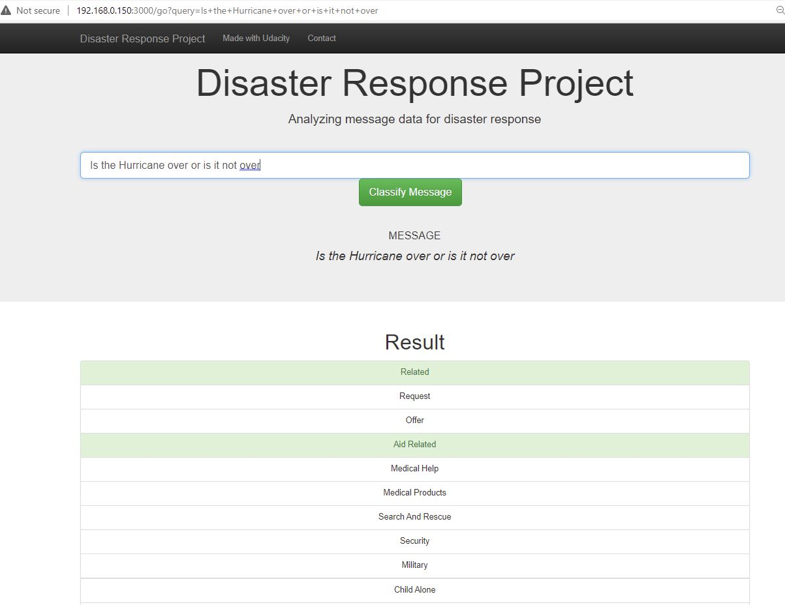

# Disaster Response Pipeline Project

## Table of Contents
1. [Installation](#installation)
2. [Project Motivation](#motivation)
3. [File Descriptions and Instructions](#files)
4. [Results](#results)
5. [Licensing, Authors, and Acknowledgements](#licensing)

### Installation 
To run the codes in this project, the easiest way is to install Anaconda 3.9 and Plotly. Alternatively, the user could 
install the following libraries:
1. Pandas
2. Numpy
3. Sci-kit Learn
4. SQL Alchemy
5. NLTK
6. Flak
7. Plotly

### Project Motivation 
In this project, we are analyzing disaster data from Appen (formally Figure 8) to build a model and an API that classifies
disaster messages (total 36 categories). The raw data are stored in CSV files. The project will build an ETL pipeline to
load the data into sqlite database, and build a machine learning pipeline to train the models. The project will then create a
web API to take input messages and triage them to different categories. 

### File Descriptions and Instructions 
The project has four subfolders: app, data, models, screenshots. Among them:
* app folder contains files related run Web API
* data folder contains raw data (`disaster_messages.csv` and `disaster_categories.csv`), ETL pipeline `process_data.py`,
Jupyter notebook for ETL pipeline practice `ETL Pipeline Preparation.ipynb`, and sqlite database `disaster_db.db`.
* models folder contains machine learning pipeline `train_classifier.py`, Jupyter notebook for ML pipeline practice
`ML Pipeline Preparation.ipynb`. The saved model file `disaster_model.pkl` is too large and cannot be uploaded to Github.
* screenshots folder contain example output during runtime.

1. Run the following commands in the project's root directory to set up your database and model.

    - To run ETL pipeline that cleans data and stores in database
        `python data/process_data.py data/disaster_messages.csv data/disaster_categories.csv data/disaster_db.db`
    - To run ML pipeline that trains classifier and saves
        `python models/train_classifier.py data/disaster_db.db models/disaster_model.pkl`

2. Go to `app` directory: `cd app`

3. Run your web app: `python run.py`

4. Click the `PREVIEW` button to open the homepage

### Results 

### License

Credit to Appen for the data to train the model and Udacity for the instructions. 
Feel free to use the code here as you would like.